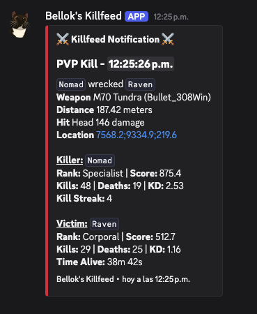
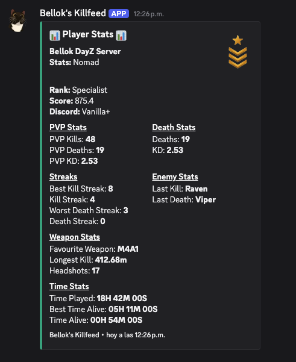
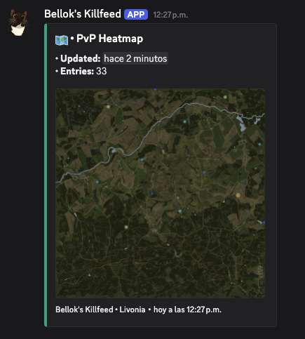

# Bellok’s Killfeed

[](https://github.com/Marcodggz/bellok-dayz-bot/actions/workflows/quality.yml)


A production-style Discord bot that transforms raw DayZ PlayStation server logs into a live killfeed, player statistics, leaderboards, and activity heatmaps.

Built with strict TypeScript, Node.js, Discord.js, the Nitrado API, and a fully automated quality pipeline.

## Preview

### Live PvP Killfeed



### Player Statistics



### PvP Activity Heatmap



## What It Does

Bellok’s Killfeed continuously reads ADM logs from a Nitrado-hosted DayZ server and converts low-level game events into useful Discord features:

- structured PvP, melee, and explosion kill notifications;
- persistent player statistics and PlayStation gamertag linking;
- leaderboards for kills, deaths, K/D, streaks, headshots, distance, and playtime;
- PvP and player-location heatmaps for Livonia and Chernarus;
- accurate player session and life-cycle tracking;
- diagnostic and local mock modes for safer development.

## Engineering Highlights

The project is designed to handle real operational problems rather than assuming perfect input:

- incremental ADM downloads instead of repeatedly processing complete files;
- safe handling of file rotation and lines split between downloads;
- persistent deduplication to prevent repeated kills after restarts;
- retryable Discord delivery without duplicating successful messages;
- atomic JSON writes to reduce persistence corruption risk;
- strict TypeScript across the source code;
- **299 automated tests across 33 test files**;
- GitHub Actions validation on every push and pull request.

For the complete data flow and technical decisions, see
[Architecture and Technical Decisions](docs/ARCHITECTURE.md).

## Tech Stack

- **Language:** TypeScript with `strict: true`
- **Runtime:** Node.js 24
- **Discord:** discord.js v14
- **API integration:** Axios and the Nitrado API
- **Rendering:** pngjs
- **Persistence:** local JSON with atomic writes
- **Testing:** Vitest
- **Quality:** ESLint, Prettier, and GitHub Actions
- **Build output:** CommonJS JavaScript in `dist`

## Quick Start

### Requirements

- Node.js 24 or newer
- npm
- A Discord application and bot token
- A Nitrado DayZ PlayStation server with ADM log access

The expected Node.js version is defined in `.nvmrc`.

```bash
git clone https://github.com/Marcodggz/bellok-dayz-bot.git
cd bellok-dayz-bot
nvm use
npm ci
cp .env.example .env
```

Add the required Discord and Nitrado values to `.env`.

The full variable reference is available in
[Environment Configuration](docs/ENVIRONMENT.md).

Start the bot:

```bash
npm start
```

The `prestart` script compiles the TypeScript project before running `dist/index.js`.

## Available Discord Commands

- `/link` — link a Discord user to a PlayStation gamertag
- `/unlink` — remove the current link
- `/stats` — display persistent player statistics
- `/leaderboard` — display top-15 rankings by:
  - rank, kills, deaths, K/D, headshots;
  - kill streak, death streak, longest kill;
  - time alive and total time played.

Commands register automatically when the bot starts and `DISCORD_CLIENT_ID` is configured.

They can also be registered independently:

```bash
npm run register-commands
```

## Development and Quality

Run the complete local verification:

```bash
npm run lint
npm run format:check
npm run typecheck
npm test
npm run build
```

Or run the main combined check:

```bash
npm run check
```

Generate a coverage report:

```bash
npm run test:coverage
```

GitHub Actions runs installation, linting, formatting checks, all tests, TypeScript validation, and the production build.

## Local and Diagnostic Modes

After building, the compiled entrypoint supports several development modes:

```bash
node dist/index.js mock-parse
node dist/index.js diagnose
node dist/index.js discord-test
node dist/index.js discord-heatmap-test
node dist/index.js discord-weekend-heatmap-test
```

`mock-parse` processes synthetic ADM data locally. The diagnostic and Discord test modes connect to configured external services.

## Documentation

- [Architecture and Technical Decisions](docs/ARCHITECTURE.md)
- [Environment Configuration](docs/ENVIRONMENT.md)

## Behind the Name

**Bellok’s Killfeed** is named after Bella, the project’s cat supervisor, who contributed absolutely no code but maintained strict oversight throughout development.

## Author

**Marco Domínguez Gil**

Software engineer focused on TypeScript, Node.js, API integrations, automation, testing, and maintainable application architecture.
