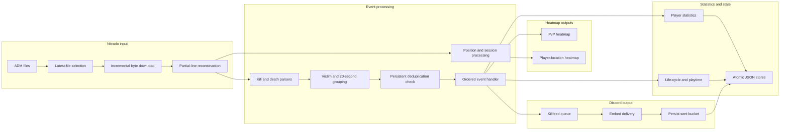

# Architecture and Technical Decisions

## Overview

Bellok’s Killfeed is a modular TypeScript application that transforms DayZ PlayStation ADM logs into Discord killfeed notifications, persistent player statistics, leaderboards, and activity heatmaps.

The source code is compiled to CommonJS JavaScript in `dist`. The root `index.ts` entrypoint coordinates the runtime while API access, parsing, polling, persistence, Discord commands, statistics, killfeed handling, tracking, and rendering remain separated under `src/`.

## System Flow



## Entrypoints

### `index.ts`

The main runtime entrypoint:

- loads environment configuration;
- creates the Discord client;
- registers slash commands when `DISCORD_CLIENT_ID` is available;
- selects and polls the latest ADM file;
- processes session, death, killfeed, statistics, and heatmap activity;
- schedules killfeed queue delivery;
- exposes diagnostic and test modes through `process.argv`.

The compiled production entrypoint is `dist/index.js`.

### `register-commands.ts`

A standalone entrypoint for globally registering Discord slash commands.

The compiled entrypoint is `dist/register-commands.js`.

### CLI Modes

The main compiled entrypoint supports:

- normal bot execution;
- local synthetic ADM parsing;
- Nitrado diagnostics;
- killfeed channel verification;
- PvP heatmap channel verification;
- player-location heatmap channel verification.

CLI handlers live in `src/cli/`.

## Main Modules

- `src/api/` — Nitrado requests, downloads, file listing, cooldowns, and response handling
- `src/cli/` — local, diagnostic, and Discord channel test modes
- `src/config/` — environment values and project-relative path resolution
- `src/features/commands/` — slash command definitions, registration, and interaction handling
- `src/features/killfeed/` — grouping, enrichment, deduplication, embeds, queueing, and delivery
- `src/features/polling/` — ADM file selection, offsets, rotation, and partial-line reconstruction
- `src/features/stats/` — PvP statistics, non-PvP deaths, sessions, playtime, and life-cycle state
- `src/features/tracking/` — player-position extraction from ADM lines
- `src/parsers/` — PvP, explosion, and non-PvP death parsing
- `src/storage/` — runtime state, statistics, gamertag links, and heatmap stores
- `src/types/` — domain, Nitrado, heatmap, and persistence types
- `src/utils/` — coordinate conversion, heatmap rendering, scheduling, ranks, and shared helpers

## ADM Polling

`src/features/polling/admFilePoller.ts` selects the latest ADM file returned by Nitrado and persists a byte offset for each processed file.

Each poll downloads the current file and reads only bytes after the stored offset.

### Rotation and Replacement

If the downloaded file becomes smaller than the stored size, it is treated as rotated or replaced. Processing safely resumes from byte zero.

When the latest ADM filename changes, a new file state is created. The first startup can optionally begin at the existing end of the file through `START_AT_END`.

### Partial Lines

A Nitrado response may end in the middle of an ADM line.

The incomplete fragment is stored as `carry` and prepended to the next downloaded chunk. Only complete lines are returned for processing.

This prevents malformed events without repeatedly processing the full file.

## Event Parsing and Grouping

`src/features/killfeed/killEventProcessor.ts` first updates tracked player positions and then parses supported competitive deaths:

- PvP kills;
- melee kills;
- explosion deaths.

Parsed events are grouped using a key composed of the victim and a 20-second ADM time bucket.

If more than one competitive event exists for the same bucket, PvP receives priority over explosion. This avoids duplicate notifications when several ADM lines describe the same death.

### Final-Hit Enrichment

For PvP deaths, the processor searches the same ADM batch for the fatal hit line containing `[HP: 0]`.

When available, ammunition, hit zone, and damage are taken from that final impact instead of relying only on the summary death line.

## Ordered Processing

`src/features/killfeed/killEventHandler.ts` matches grouped deaths back to their source lines and walks the ADM batch in original order.

For every line, it can:

1. process connection or disconnection activity;
2. normalize the ADM time;
3. process confirmed non-PvP deaths;
4. update competitive statistics;
5. capture killer and victim statistics for the embed;
6. queue the Discord notification;
7. return the victim position for the PvP heatmap.

Preserving line order is important for accurate session and life-cycle calculations.

## Player Sessions and Life Cycle

`src/features/stats/playerSessionProcessor.ts` parses connection and disconnection lines and converts ADM `HH:MM:SS` values into a monotonic timeline.

When the clock moves backwards, the normalizer treats it as a midnight rollover and adds 24 hours.

Player statistics track:

- connection state;
- alive or dead state;
- current-life time;
- accumulated playtime;
- previous and best life duration;
- kills and deaths;
- current and best streaks;
- last PvP opponent;
- weapon usage and favourite weapon;
- score and rank.

A live disconnect pauses the current life. Reconnecting resumes it. A confirmed death closes the life, and a new life begins only after a later connection event.

Active sessions are reset safely when the bot restarts because normalized ADM timestamps are process-relative.

## Non-PvP Deaths

`src/parsers/nonPvpDeathParser.ts` and `src/features/stats/nonPvpDeathProcessor.ts` handle confirmed deaths caused by:

- zombies;
- wolves;
- bears;
- general or natural death lines.

These events close the current life and reset the kill streak, but they do not:

- increment PvP deaths;
- increment the death streak;
- enter the Discord killfeed;
- enter the PvP heatmap.

General death lines are ignored when a matching competitive death already exists for the same victim and ADM timestamp.

## Persistent Deduplication

Competitive deaths are deduplicated by victim and 20-second bucket.

Sent buckets are persisted in `state.json`.

The deduplicator:

- loads previous buckets during startup;
- removes entries older than one hour;
- keeps at most 1,000 recent entries;
- prevents repeated queueing after restarts or ADM rereads.

A bucket is marked as sent only after Discord accepts the main embed.

## Discord Delivery Queue

Killfeed events are added to an in-memory queue and flushed every ten minutes.

During a flush:

1. the configured Discord channel is resolved;
2. the first event is converted into an embed;
3. Discord delivery is attempted;
4. successful events are removed from the queue;
5. their deduplication bucket is persisted.

If delivery fails, processing stops and remaining events stay queued for the next flush.

Optional raw ADM delivery is isolated from the main embed. A raw-line failure does not resend an already successful kill notification.

## Heatmaps

### PvP Heatmap

Competitive victim positions are stored in the PvP heatmap state.

The renderer:

- maps DayZ world coordinates onto a configured map image;
- groups nearby points into spatial clusters;
- draws intensity-based radial gradients;
- updates one persistent Discord message;
- removes the attachment when the activity window is empty.

### Player-Location Heatmap

Player positions extracted from ADM lines are also sent to the weekend heatmap system.

It:

- operates on Friday, Saturday, and Sunday;
- keeps the latest position for each player;
- prunes old positions by the configured activity window;
- clusters nearby players;
- renders one editable Discord message.

Map conversion and appearance are controlled through environment variables documented in `ENVIRONMENT.md`.

## Discord Commands

The command layer provides:

- `/link`;
- `/unlink`;
- `/stats`;
- `/leaderboard` with rankings for score, kills, deaths, K/D, headshots, streaks, longest kill, time alive, and total playtime.

Definitions and interaction handling remain separate from the main runtime entrypoint.

## Persistence

Runtime state is stored locally in JSON files.

The storage layer includes:

- ADM offsets, carry fragments, and sent buckets;
- player statistics;
- Discord-to-gamertag links;
- PvP heatmap state;
- player-location heatmap state;
- mock statistics for local parsing.

`src/storage/jsonStore.ts` writes to a temporary file and renames it over the destination. This atomic replacement reduces the chance of leaving partially written JSON after an interrupted operation.

Player statistics, gamertag links, mock data, and rank assets are resolved from the project root. Polling and heatmap files use the configured runtime paths, which default to locations relative to the process working directory.

JSON is appropriate for the current single-process deployment. A database would become more suitable if the application required concurrent writers, horizontal scaling, larger datasets, or advanced querying.

## Type System

The project uses TypeScript with `strict: true`.

Domain types are separated into:

- kill, death, session, position, and player-stat events;
- Nitrado API responses and download results;
- heatmap points, clusters, and persisted state;
- partial persisted statistics and linked-gamertag records.

Discriminated unions distinguish PvP, explosion, non-PvP death, connection, and disconnection events.

The source compiles through `tsc` into CommonJS JavaScript under `dist`.

## Testing and Continuous Integration

The Vitest suite currently contains 308 tests across 34 test files.

Coverage includes:

- Nitrado API responses and cooldowns;
- ADM polling, offsets, rotation, and partial lines;
- PvP, explosion, and non-PvP parsing;
- grouping and final-hit enrichment;
- persistent deduplication;
- Discord queue retries;
- player statistics and life-cycle behavior;
- command responses and gamertag linking;
- atomic JSON persistence;
- coordinate mapping and heatmap helpers;
- TypeScript domain assumptions.

GitHub Actions runs the following on every push and pull request:

```text
npm ci
npm run lint
npm run format:check
npm test
npm run typecheck
npm run build
```
